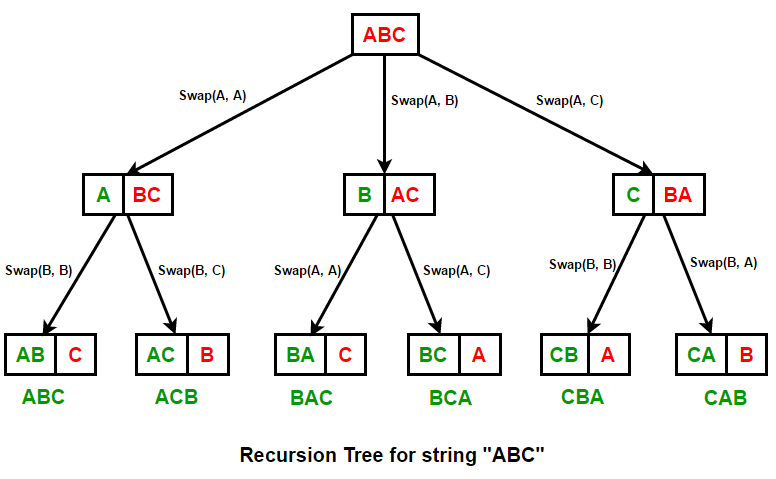

<blockquote>
per·mu·ta·tion
<br>
<br>
a way, especially one of several possible variations, in which a set or number of things can be ordered or arranged.
</blockquote>

If you haven't ran across this problem yet, you undoubtedly will sometime soon.

Below is an image of a recursion tree for the string 'ABC' (courtesy of geeksforgeeks).



You start with the first letter 'A' and find all possible variations of 'BC', which lead to 'ABC' and 'ACB'.

You move onto the second letter 'B' and find all possible variations of 'AC', which lead to 'BAC' and 'BCA'.

You finish with the third letter 'C' and find all possible variations of 'AB', which lead to 'CAB' and 'CBA'.

Looking at this pattern, we know we'll need to iterate through each letter of the string to find all permutations, but also iterate through the remaining characters of that letter in the string to find all permutations of those as well, leading me to think that recursion is the best approach.

Let's start with a few of the simple things.

```javascript
const findPermutations = str => {
  // track each permutation in an array
  const arr = [];

  // iterate over each letter of str input
  for (let i = 0; i < str.length; i++) {
    // ...
  }

  return arr;
};
```

We start with an array to keep track of all the permutations, iterate over each character in the str input, and return the arr. Now let's handle any edge cases and beginning setting up for the recursion.

```javascript
const findPermutations = str => {
  // handles edge-case of str of length 1
  if (str.length === 1) {
    return str;
  }

  const arr = [];

  for (let i = 0; i < str.length; i++) {
    // track current char
    const currentChar = str[i];
    // track remaining chars
    const remainingChars = str.slice(0, i) + str.slice(i + 1, str.length);

    // handle recursion
  }

  return arr;
};
```

Previously, we know from the recursion tree that we'll want to keep track of the current character and find all permutations of the remaining characters. Now we're set up for it. Lastly we just need to handle the recursion.

```javascript
const findPermutations = str => {
  if (str.length === 1) {
    return str;
  }

  const arr = [];

  for (let i = 0; i < str.length; i++) {
    const currentChar = str[i];
    const remainingChars = str.slice(0, i) + str.slice(i + 1, str.length);

    for (let permutation of findPermutations(remainingChars)) {
      arr.push(currentChar + permutation);
    }
  }

  return arr;
};

findPermutations("abc");
// [ 'abc', 'acb', 'bac', 'bca', 'cab', 'cba' ]
```

If the recursion portion doesn't make sense, let's review the recursion tree.

We want to iterate over each character and check for permutations of all remaining characters.
We do this by running the remaining characters through our <code>findPermutations</code> function
and returning the permutations array once the function has finished traversing down a path.
Then we push all possible permutations of the current character into our array and continue the iteration
with the same pattern.

One thing you might notice, however, is that we'll end up with some extra permutations if we have a duplicate char.

```javascript
findPermutations("aabc");
/* [
  'aabc', 'aacb', 'abac',
  'abca', 'acab', 'acba',
  'aabc', 'aacb', 'abac',
  'abca', 'acab', 'acba',
  'baac', 'baca', 'baac',
  'baca', 'bcaa', 'bcaa',
  'caab', 'caba', 'caab',
  'caba', 'cbaa', 'cbaa'
] */
```

Let's fix this.

```javascript
const findPermutations = str => {
  if (str.length === 1) {
    return str;
  }

  const arr = [];

  for (let i = 0; i < str.length; i++) {
    const currentChar = str[i];
    const remainingChars = str.slice(0, i) + str.slice(i + 1, str.length);

    if (str.indexOf(currentChar) !== i) continue;

    for (let permutation of findPermutations(remainingChars)) {
      arr.push(currentChar + permutation);
    }
  }

  return arr;
};
```

The new line let's us skip over the current character if it's not the first element in the string,
which effectively cuts down on any duplications.

<h3>Conclusion</h3>

We got to practice some more recursion with this problem and also got to use the for...of loop.
The for...of loops are useful when you don't need access to <code>i</code> and just need to perform an iteration.
