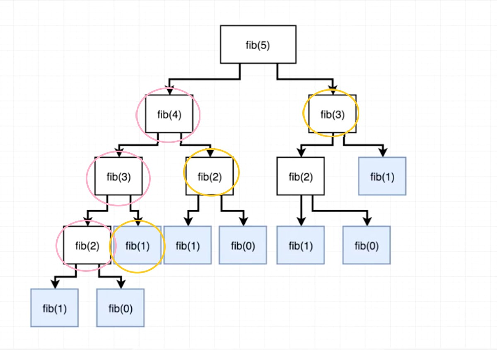

<h3>What is memoization?</h3>

Memoization is an optimization technique used to speed up programs by storing the results of function calls and returning the cached output when a saved input occurs again.

Let's review the recursive Fibonacci solution.

```javascript
function fibonacci(num) {
    if (num < 2) return num;

    return fibonacci(num - 1) + fibonacci(num - 2)
}

fibonacci(5) // 5

// fibonacci(5) => fibonacci(4) + fibonacci(3)

// fibonacci(4)
// fibonacci(3) + fibonacci(2)
// fibonacci(2) + fibonacci(1) + fibonacci(1) + fibonacci(0)
// fibonacci(1) + fibonacci(0) + 1 + 1 + 0
// 1 + 0 + 1 + 1 + 0 => 3

// fibonacci(3)
// fibonacci(2) + fibonacci(1)
// fibonacci(1) + fibonacci(0) + 1
// 1 + 0 + 1 => 2

// 3 + 2 => 5
```

This fibonacci function takes a number and returns the sum of the two previous numbers in the Fibonacci sequence. It breaks out of the recursion when it hits the base case of either 0 or 1.

You can see with fibonacci(5) that fibonacci(3) gets called 2 times while fibonacci(2) gets called 3 times. It might not be clear with the earlier Fibonacci numbers, but you can imagine how many repeated calls would occur with numbers like the 10th Fibonacci number and beyond.

Here is a solution with memoization implemented.

```javascript
fibonacci(num, memo) {
    // Check for a memoized object being passed in/down
    // or create a new one
    memo = memo || {};

    // If a cached result exists, return it
    if (memo[num]) return memo[num];

    // Or return the base case
    if (num < 2) return num;

    // Otherwise, continue the recursion and set the cached result
    // when you hit a base case
    return memo[num] = fibonacci(num - 1, memo) + fibonacci(num - 2, memo);
}
```

Our function now takes a <code>memo</code> parameter along with number. We're using it here to cache the result of a Fibonacci number when it completes and then we use that cached result to speed up any subsequent calls.

<br>

In the example of fibonacci(5), we recursively call our function until fibonacci(2) returns a value of 1 + 0 => 1. This result gets cached in our memo object (functions circled in pink) and it allows us to check for an existing Fibonacci number value before recursively calling our function in the following calls.

fibonacci(3) returns fibonacci(2) + fibonacci(1), in which we have a cached result and a base case, speeding up the time to return a value. When this completes, we store the value of fibonacci(3) in our memo object and continue to calculate the functions circled in gold.

<h3>Conclusion</h3>

I haven't calculated the exact numbers, but you can see in theory how much function calls can be sped up with a simple memoization. This really shines as the recursion tree grows larger.
