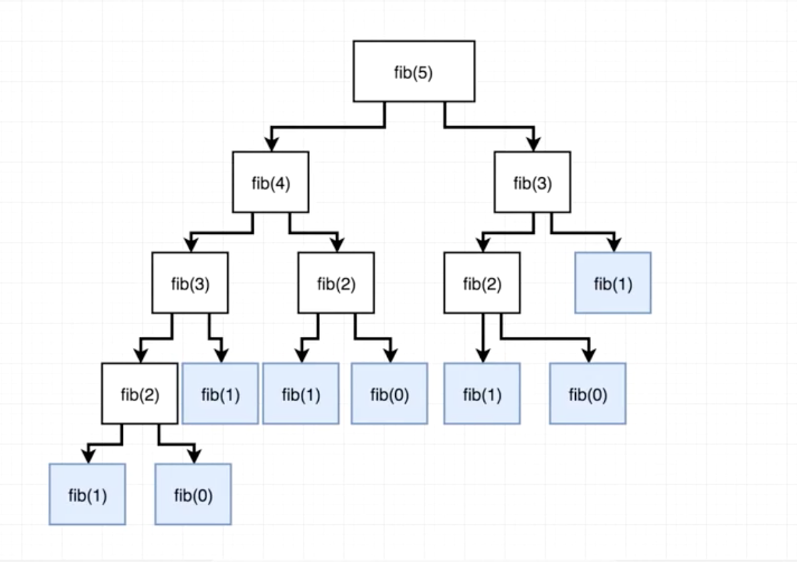

<h3>What is recursion?</h3>

Simply put, recursion is a function that calls itself.

<h3>Why would I ever need that?</h3>

Let's take a look at the Fibonacci sequence.

If you aren't already familiar, the Fibonacci sequence is:

0, 1, 1, 2, 3, 5, 8, 13, 21, 34, 55...

Notice a pattern? A Fibonacci number is a sum of the two previous numbers. The 0th Fibonacci number is 0, first Fibonacci number is 1, second is 1, third is 2, fourth is 3, etc etc.

Solving this by hand would be a huge pain so let's try this with recursion.

Note: Some solutions may start with Fibonacci numbers "1, 1", but we're going to use "0, 1" here.

```javascript
function fibonacci(num) {
    // Base case
    if (num < 2) return num;
}

fibonacci(0) // 0
fibonacci(1) // 1
```

We start off with the simple base cases to cover the first two numbers (including 0th). If you try this out as is, it would cover up to fibonacci(1).

Let's cover the rest.

```javascript
function fibonacci(num) {
    if (num < 2) return num;

    return fibonacci(num - 1) + fibonacci(num - 2)
}

fibonacci(5) // 5
```

At first glance, this may make your head spin but that's all right. We can break this down.

```javascript
function fibonacci(num) {
    if (num < 2) return num;

    return fibonacci(num - 1) + fibonacci(num - 2)
}

fibonacci(5) // 5

// fibonacci(5) => fibonacci(4) + fibonacci(3)

// fibonacci(4)
// fibonacci(3) + fibonacci(2)
// fibonacci(2) + fibonacci(1) + fibonacci(1) + fibonacci(0)
// fibonacci(1) + fibonacci(0) + 1 + 1 + 0
// 1 + 0 + 1 + 1 + 0 => 3

// fibonacci(3)
// fibonacci(2) + fibonacci(1)
// fibonacci(1) + fibonacci(0) + 1
// 1 + 0 + 1 => 2

// 3 + 2 => 5
```

fibonacci(5) essentially returns fibonacci(4) + fibonacci(3), which in turns calls itself and continues passing down the number until it hits the base case returning either 0 or 1.

If you still haven't quite wrapped your head around it, check out the visualization created by Stephen Grider below.



<h3>Conclusion</h3>

Recursion may be a headache to understand at first, but you can see the power it can have with problems that may have a pattern that you can follow to solve it.
